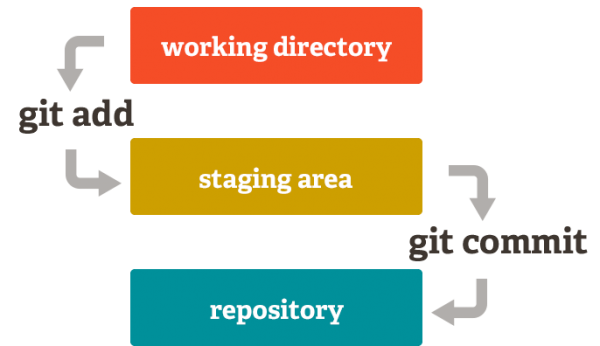

# How To Git / GitHub (Espanhol)
## Clique para ver a Versão em [Português](https://github.com/aledruetta/HowTo/blob/master/README_pt-BR.md)
===================

¿Cómo crear un repositorio local?
---------------------------------

- Crear una carpeta local:

<!-- language: lang-bash -->

    $ mkdir <directory>
    $ cd <directory>

- Inicializar el repositorio:

<!-- language: lang-bash -->

    $ git init

- Configuración:

<!-- language: lang-bash -->

    $ git config --global user.name “Nombre Apellido”
    $ git config --global user.email “nombre@servidor.com”

¿Cómo generar llaves SSH?
-------------------------

- Comprobar si existe alguna llave en el pc:

<!-- language: lang-bash -->

    $ cd ~/.ssh

- Generar una nueva llave SSH:

<!-- language: lang-bash -->

    $ ssh-keygen -t rsa -C "tu_email@ejemplo.com"

¿Cómo tomar la llave SSH para vincular a GitHub
-----------------------------------------------

<!-- language: lang-bash -->

    $ cat ~/.ssh/id_rsa.pub

¿Cómo clonar un repositorio de GitHub?
--------------------------------------

<!-- language: lang-bash -->

    $ git clone [url]

- Ejemplo:

<!-- language: lang-bash -->

    $ git clone git://github.com/user/repo.git <directory>
    $ cd <directory>
    $ ls -a
    $ ls .git

¿Cómo vincular un repositorio local y otro remoto?
--------------------------------------------------

<!-- language: lang-bash -->

    $ git remote add origin git://github.com/user/repo.git

- Si nuestros datos son locales (están en la PC):

<!-- language: lang-bash -->

    $ git push -u origin master

- Si nuestros datos son remotos (están en el servidor):

<!-- language: lang-bash -->

    $ git pull origin master

¿Cómo cambiar el origen remoto de un repositorio local?
-------------------------------------------------------

> Si, por ejemplo, renombramos nuestro repositorio en GitHub, vamos a tener
> que actualizar la url del origen remoto en nuestro repositorio local:

- Para ver el origen remoto actual:

<!-- language: lang-bash -->

    $ git remote -v

- Para actualizar la url:

<!-- language: lang-bash -->

    $ git remote set-url origin new_url

¿Cómo actualizar el repositorio local cuando su origen es un fork?
------------------------------------------------------------------

- Configurar el upstream (sólo una vez)

<!-- language: lang-bash -->

    $ git remote add upstream git@github.com:user/repo.git
    $ git remote -v

- Para actualizar los cambios que se hayan producido en upstream.

<!-- language: lang-bash -->

    $ git fetch upstream
    $ git rebase upstream/master

¿Cómo ver el estado en que se encuentra el repositorio?
-------------------------------------------------------

> El flujo de trabajo es el siguiente:
> Agregar (Track), Modificar (Edit), Preparar (Stage), Confirmar (Commit).

<!-- language: lang-bash -->

    $ git status

> La instrucción status le indicará si ha habido cambios en el Directorio
> de Trabajo; si hay archivos sin seguimiento (untracked) o si hay cambios
> preparados (staged) para un commit.

¿Cómo preparar archivos (Stage)?
--------------------------------

> Sólo los archivos preparados (staged) serán adicionados a la próxima
> confirmación (commit).

- Todos los archivos:

<!-- language: lang-bash -->

    $ git add .

- Archivos específicos:

<!-- language: lang-bash -->

    $ git add <file1> <file2>

- Tipos de archivos:

<!-- language: lang-bash -->

    $ git add *.py

¿Cómo quitar archivos preparados (staged) erróneamente?
-------------------------------------------------------

> Puede que haya adicionado archivos al Stage que no quería preparar.

<!-- language: lang-bash -->

    $ git reset HEAD

- Quitar de Stage sólo uno o algunos archivos:

<!-- language: lang-bash -->

    $ git reset HEAD -- <file>

¿Cómo quitar archivos sin seguimiento (untracked) agregados erróneamente?
-----------------------------------------------------------------------

> Puede que haya adicionado archivos al directorio de trabajo y quiera
> retirarlos. Si todavía no fueron adicionados para su seguimiento (untracked):

<!-- language: lang-bash -->

    $ git clean -f

¿Cómo deshacer cambios en el Directorio de Trabajo (unestage)?
---------------------------------------------------------------

> Si todavía no preparó los cambios, puede deshacerlos y dejar el Directorio
> de trabajo como en el último commit.

<!-- language: lang-bash -->

    $ git checkout -- <file>

¿Cómo confirmar archivos (Commit)?
----------------------------------

> Cuando esté listo, guarde una instantanea de su trabajo.

<!-- language: lang-bash -->

    $ git commit -m "mensaje de confirmación"

- Para preparar (staged) y confirmar de una vez:

<!-- language: lang-bash -->

    $ git commit -a -m "mensaje de confirmación"

¿Cómo ver el historial de commits?
----------------------------------

<!-- language: lang-bash -->

    $ git log

- Un log con información resumida:

<!-- language: lang-bash -->

    $ git log --oneline

- Otras opciones:

<!-- language: lang-bash -->

    # Commits por autor con email
    $ git shortlog -e

    # Últimos n commits
    $ git log -3

    # A partir de... (day, week, month, year)
    $ git log --since=5.month
    $ git log --until=2.week

    # Contiene un determinado patrón
    $ git log --grep="Merge"

    # Combinando
    $ git log -5 --oneline --since=10.day --until=4.day --grep="fix"

¿Cómo ver los cambios que se han realizado?
-------------------------------------------

- Para ver los cambios realizados desde que preparamos (add) y confirmamos (commit) por última vez:

<!-- language: lang-bash -->

    $ git diff HEAD

- Para ver los cambios realizados desde un commit en particular:

> El orden hacia atrás es: HEAD, HEAD~1, HEAD~2 ...
> HEAD~n puede reemplazarse también por el identificador SHA1 del commit.

<!-- language: lang-bash -->

    $ git diff HEAD~3

- Para ver los cambios entre dos commits:

<!-- language: lang-bash -->

    $ git diff HEAD~3 HEAD~1

- Para ver los cambios realizados que todavía no hemos preparado (unstaged).

> A veces necesitamos saber qué ha cambiado desde el último add que realizamos.

- Para ver los cambios realizados que todavía no hemos preparado (unstaged):

<!-- language: lang-bash -->

    $ git diff

> Antes de hacer un commit puede ser útil saber qué cambios estaremos
> confirmando.

- Para ver los cambios que ya hemos preparado (staged):

<!-- language: lang-bash -->

    $ git diff --cached

- Para ver un resumen de los cambios realizados agregar la opción --stat a las
instrucciones anteriores:

Ejemplo:

<!-- language: lang-bash -->

    $ git diff HEAD --stat
    HowTo.md | 43 ++++++++++++++++++++++++++-----------------
    1 file changed, 26 insertions(+), 17 deletions(-)

¿Cómo deshacer el último Commit y volver al último Stage?
---------------------------------------------------------

> Si olvidamos agregar archivos o hacer algún cambio antes de confirmar:

<!-- language: lang-bash -->

    $ git reset --soft HEAD~

¿Cómo volver a un commit en particular y hacer que este sea el último, borrando todos los que le siguen?
--------------------------------------------------------------------------------------------------------

<!-- language: lang-bash -->

    $ git reset --hard SHA1

¿Cómo eliminar archivos?
------------------------

<!-- language: lang-bash -->

    $ git rm <file>

¿Cómo renombrar archivos?
-------------------------

<!-- language: lang-bash -->

    $ git mv <file> <new_file>

¿Cómo etiquetar (tag) un commit?
--------------------------------

<!-- language: lang-bash -->

    $ git tag <tag_name>

- Listar las tags del repositorio:

<!-- language: lang-bash -->

    $ git tag

- Mostrar un commit etiquetado:

<!-- language: lang-bash -->

    $ git show <tag_name>

¿Cómo crear una rama (Branch)?
------------------------------

<!-- language: lang-bash -->

    $ git branch <branch>

¿Cómo moverse a otra rama (Branch)?
-----------------------------------

<!-- language: lang-bash -->

    $ git checkout <branch>

¿Cómo mezclar ramas (Merge)?
----------------------------

<!-- language: lang-bash -->

    $ git checkout master
    $ git merge <branch>

¿Cómo fusionar un grupo de commits en un único commit?
------------------------------------------------------

> A veces, antes de un merge o un push, queremos reorganizar el historial
> de nuestro repositorio. Para eso, ejecutamos un rebase interactivo y editamos
> la lista de commits cambiando pick por squash a partir del segundo commit
> de la lista:

<!-- language: lang-bash -->

    $ git rebase -i HEAD~4

    pick 01d1124 Agregando licencia
    squash 6340aaa Caperucita Roja se comió al Lobo
    squash ebfd367 Jekyll se ha vuelto autoconciente
    squash 30e0ccb Modificando etiquetas

> Los commits de la lista aparecen ordenados de atrás para adelante, es decir,
> el último es HEAD y el primero es HEAD~3. Nótese que HEAD~4 no aparece en la
> lista.
