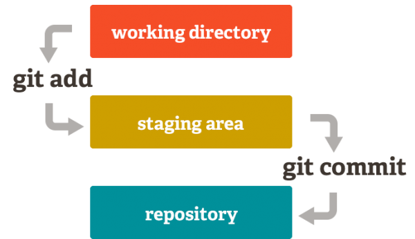

How To Git / GitHub 
===================

¿Como criar um repositório local?
---------------------------------

- criar uma pasta local:

<!-- language: lang-bash -->

    $ mkdir <directory>
    $ cd <directory>

- Inicializar o repositório:

<!-- language: lang-bash -->

    $ git init

- Configuração:

<!-- language: lang-bash -->

    $ git config --global user.name “Nome Sobrenome”
    $ git config --global user.email “user@server.com”

¿Como gerar as chaves SSH?
--------------------------

- Comprovar se existe alguma chave no PC:

<!-- language: lang-bash -->

    $ cd ~/.ssh

- Gerar uma nova chave SSH:

<!-- language: lang-bash -->

    $ ssh-keygen -t rsa -C "user@server.com"

¿Como clonar um repositório GitHub?
-----------------------------------

<!-- language: lang-bash -->

    $ git clone [url]

- Exemplo:

<!-- language: lang-bash -->

    $ git clone git://github.com/user/repo.git <directory>
    $ cd <directory>
    $ ls -a
    $ ls .git

¿Como atualizar o repositório local cuando o seu origen é um fork?
------------------------------------------------------------------

- Configurar o upstream (uma vez só)

<!-- language: lang-bash -->

    $ git remote add upstream git@github.com:user/repo.git
        $ git remote -v

- Atualizar as mudanças que tiverem sido feitas no upstream.

<!-- language: lang-bash -->

    $ git fetch upstream
    $ git rebase upstream/master

¿Como visualizar o estado atual do repositório?
-----------------------------------------------

> o fluxo de trabalho é o seguinte:
> Seguir (Track), Modificar (Edit), Preparar (Stage), Confirmar (Commit).

<!-- language: lang-bash -->

    $ git status

> O comando status vai dizer se tem havido mudanças no Diretório de
> Trabalho; se tem arquivos sem seguimento (untracked) ou se tem
> modificações preparadas (staged) para um commit.

¿Como preparar arquivos (Stage)?
--------------------------------

> Só os arquivos preparados (staged) vão ser adicionados na próxima
> confirmação (commit).

- Todos os arquivos:

<!-- language: lang-bash -->

    $ git add .

- arquivos específicos:

<!-- language: lang-bash -->

    $ git add <file1> <file2>

- Tipos de arquivos:

<!-- language: lang-bash -->

    $ git add *.py

¿Como remover arquivos preparados (staged) por erro?
----------------------------------------------------

> Pode que tenha adicionado arquivos ao Stage que não queria ter preparado.

<!-- language: lang-bash -->

    $ git reset HEAD

- Remover de Stage apenas um ou alguns dos arquivos:

<!-- language: lang-bash -->

    $ git reset HEAD -- <file>

¿Como desfazer mudanças no Diretório de Trabalho não preparadas (unestaged)?
----------------------------------------------------------------------------

> Se ainda não tem preparado as mudanças, pode desfazê-las e deixar o
> Diretório de trabalho como no último commit.

<!-- language: lang-bash -->

    $ git checkout -- <file>

¿Como confirmar arquivos (Commit)?
----------------------------------

> Cuando estiver pronto, salve uma instantánea do seu trabalho.

<!-- language: lang-bash -->

    $ git commit -m "mensagem de confirmação"

- Para preparar (staged) e confirmar de uma vez:

<!-- language: lang-bash -->

    $ git commit -a -m "mensagem de confirmação"

¿Como visualizar o historial de commits?
----------------------------------------

<!-- language: lang-bash -->

    $ git log

- um log con informação resumida:

<!-- language: lang-bash -->

    $ git log --oneline

¿Como visualizar as mudanças que se tem realizado?
--------------------------------------------------

- Para visualizar as mudanças realizadas desde que preparamos (add) e confirmamos (commit) pela última vez:

<!-- language: lang-bash -->

    $ git diff HEAD

- Para visualizar as mudanças realizadas desde um commit em particular:

> a ordem retrocedendo é: HEAD, HEAD~1, HEAD~2 ...
> HEAD~n pode ser reemplazado también pelo identificador SHA1 do commit.

<!-- language: lang-bash -->

    $ git diff HEAD~3

- Para visualizar os cambios entre dos commits:

<!-- language: lang-bash -->

    $ git diff HEAD~3 HEAD~1

- Para visualizar os cambios realizados que ainda não temos preparado (unstaged).

> As vezes necesitamos saber o que tem mudado desde o último add que realizamos.

- Para visualizar os cambios realizados que ainda não temos preparado (unstaged):

<!-- language: lang-bash -->

    $ git diff

> Antes de de se fazer um commit pode ser útil saber que mudanças estaremos
> confirmando.

- Para visualizar as mudanças que já temos preparado (staged):

<!-- language: lang-bash -->

    $ git diff --cached

- Para visualizar um resumo das mudanças realizadas adicionar a opção
  --stat às instruções anteriores:

Exemplo:

<!-- language: lang-bash -->

    $ git diff HEAD --stat
    HowTo.md | 43 ++++++++++++++++++++++++++-----------------
 	1 file changed, 26 insertions(+), 17 deletions(-)

¿Como desfazer o último Commit e voltar ao último Stage?
--------------------------------------------------------

> Se esquecemos adicionar arquivos o fazer alguma mudança antes de confirmar:

<!-- language: lang-bash -->

    $ git reset --soft HEAD~

¿Como voltar a um commit em particular e fazer que seja o último, apagando todos os que lhe siguen?
----------------------------------------------------------------------------------------------------

<!-- language: lang-bash -->

    $ git reset --hard SHA1

¿Como eliminar arquivos?
------------------------

<!-- language: lang-bash -->

    $ git rm <file>

¿Como renomear arquivos?
------------------------

<!-- language: lang-bash -->

    $ git mv <file> <new_file>

¿Como criar um 'galho' (Branch)?
--------------------------------

<!-- language: lang-bash -->

    $ git branch <branch>

¿Como moverse a otra 'galho' (Branch)?
--------------------------------------

<!-- language: lang-bash -->

    $ git checkout <branch>

¿Como misturar 'galhos' (Merge)?
--------------------------------

<!-- language: lang-bash -->

    $ git checkout master
    $ git merge <branch>

